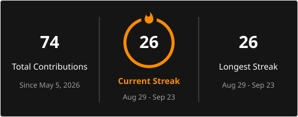

<div align="center">

# 👋 Hi, fellow human being!

### I'm **Balashanmugam** — but you can call me **Bala**.


<br>

[](https://github.com/Balashanmugam-rathinam)
[](https://linkedin.com/in/YOUR-LINKEDIN-USERNAME)
[](https://YOUR-PORTFOLIO-URL)
[](mailto:balashanmugamrathinam@gmail.com)


</div>

---

## 👋 Hello, Stranger!

If you've somehow ended up here...

**Welcome to my little corner of GitHub.** ☕💻

I'm **Bala**, an MSc Data Science graduate who enjoys understanding how technology works, building things with it, and occasionally breaking things just to figure out why they broke.

These days, I'm moving deeper into **🛡️ Cybersecurity**, with my main focus on becoming a **SOC Analyst**.

But here's the thing...

### 💻 I Don't Only Like Cybersecurity

I genuinely love building software too.

🌐 Websites  
⚙️ Backend APIs  
📱 Applications  
🤖 AI projects  
🔧 Automation tools  
☁️ Cloud deployments  
🐧 Linux & systems  
🌐 Networking  
🧪 Random experiments

Basically, if something is technical and interesting, there's a good chance I'll want to touch it.

Usually the thought process is:

> **"Hmm... I wonder if I can build that."**

Sometimes I can.

Sometimes I spend three hours debugging something just to discover I forgot one character.

**That's part of the adventure. 😂**

---

# 🧭 What Am I Up To?

My current career direction is:

## 🛡️ Cybersecurity → SOC Analyst

I'm currently learning:

🔐 Security Monitoring  
📊 SIEM  
🔍 Threat Detection  
🚨 Incident Response  
📜 Log Analysis  
🌐 Network Security  
🎯 Threat Hunting  
🧩 MITRE ATT&CK

At the same time, I'm still building software because I genuinely enjoy development.

|     | Area                        |
| --- | --------------------------- |
| 🛡️  | **Cybersecurity**           |
| 💻  | **Backend Development**     |
| 🌐  | **Web Development**         |
| 📱  | **Application Development** |
| 🤖  | **AI & Computer Vision**    |
| 🐧  | **Linux & Systems**         |
| ☁️  | **Cloud & DevOps**          |
| 🌐  | **Networking**              |
| 🔧  | **Automation**              |

I don't really want to put myself inside one tiny box.

If it's technical, interesting, and gives me a reason to say:

> **"Let me see how this works."**

I'm probably interested.

---

# 🛡️ Cybersecurity Journey

I'm learning cybersecurity mainly through **hands-on labs and experimentation** rather than just watching videos.

### 🔐 Areas I'm Exploring

🛡️ **SOC Operations**  
📊 **SIEM**  
🔍 **Threat Detection**  
🚨 **Incident Response**  
📜 **Log Analysis**  
🌐 **Network Security**  
🎯 **Threat Hunting**  
🧩 **MITRE ATT&CK**

### 🧰 Security Tools

`Wazuh` · `Splunk` · `Wireshark` · `Nmap` · `TryHackMe`

My favorite part?

Seeing something suspicious and asking:

> 🔎 **"Okay... what actually happened here?"**

Then following the evidence.

---

# 💻 Development Life

Cybersecurity may be my current career direction...

**but I still love writing code. ❤️**

### ⚙️ Backend


`Python` · `FastAPI` · `Django` · `Flask` · `REST APIs`

### 🌐 Frontend


`React` · `Next.js` · `JavaScript` · `TypeScript` · `Tailwind CSS`

### 🗄️ Databases


`PostgreSQL` · `MySQL` · `MongoDB`

### ☁️ Cloud & DevOps


`Azure` · `AWS` · `Docker` · `Linux` · `Git` · `GitHub Actions`

### 🤖 AI & Data


`OpenCV` · `TensorFlow` · `PyTorch` · `Pandas` · `NumPy` · `Power BI`

---

# 🚀 Things I've Built

## 🌐 Sky Tech — Business Website

Built a complete website for a local gate-automation business.

Handled the project end-to-end:

🎨 UI  
💻 Frontend  
⚙️ Backend API  
📱 Responsive Design  
📨 Enquiry System  
🚀 Deployment

Customer enquiries are routed directly to WhatsApp.

**Stack:**

`Next.js` · `React` · `TypeScript` · `Tailwind` · `FastAPI`

---

## 📥 Instagram Reel Downloader

Built a FastAPI application around `yt-dlp` and took it from:

💻 **localhost**

to:

☁️ **Azure Ubuntu VM**

Worked with:

`Python` · `FastAPI` · `Azure` · `Linux` · `Docker` · `systemd`

This project taught me something important:

> 🚀 **"It works on my machine" is not a deployment strategy.**

---

## 🤖 VerifyMeAI

A computer-vision project that verifies human interaction using face detection and hand gestures.

Because apparently clicking:

> ☑️ **"I'm not a robot"**

wasn't interesting enough.

**Stack:**

`Python` · `OpenCV` · `MediaPipe` · `Flask`

---

## 🔎 PyTrace

A Python traceroute utility built using Scapy.

I wanted to understand what actually happens to packets while they travel across a network instead of simply typing a command and pretending I understood everything.

**Stack:**

`Python` · `Scapy` · `ICMP` · `Linux` · `Networking`

---

## 🧪 Selenium Automation Framework

A reusable Selenium + PyTest framework for browser automation.

Built mainly because writing the same browser setup code again and again became increasingly annoying.

**Stack:**

`Python` · `Selenium` · `PyTest`

---

# 🧠 Currently Learning

### 🛡️ Cybersecurity

```text
🔐 SOC Operations
📊 SIEM
🔍 Threat Detection
🚨 Incident Response
🎯 Threat Hunting
🧩 MITRE ATT&CK
```

### 🌐 Networking

```text
📡 TCP/IP
🌍 DNS
🔗 HTTP / HTTPS
🛣️ Routing
🔥 Firewalls
🔎 Packet Analysis
```

### 🐧 Systems

```text
🐧 Linux
🪟 Windows
🏢 Active Directory
```

### 💻 Development

```text
🐍 Python
⚙️ Backend Development
🌐 Full-Stack Development
📱 Application Development
🔌 APIs
☁️ Deployment
```

---

# 🧪 How I Learn

I learn better when I **actually build something**.

```text
📖 Read about it
       ↓
💻 Build something
       ↓
💥 Break it
       ↓
🔎 Investigate
       ↓
🧠 Understand why
       ↓
🔧 Fix it
       ↓
🛡️ Secure it
       ↓
🚀 Build something else
       ↓
      🔁
```

**Repeat forever.**

---

# 🤔 Random Things About Me

🧠 I like understanding things from the fundamentals.

🔧 I enjoy fixing problems almost as much as creating them.

🐛 Bugs are basically unpaid teachers.

💻 I can jump from cybersecurity to backend development to some completely random project because curiosity doesn't understand job descriptions.

🔎 If something doesn't make sense, I want to know **why**.

📚 I prefer learning by doing.

🚀 I like turning ideas into actual working things.

😂 And yes...

Sometimes the solution really is:

```text
Have you tried restarting it?
```

---

# 🎯 Where I'm Heading

My primary career goal is:

## 🛡️ SOC Analyst / Cybersecurity

At the same time, I'm continuing to grow in:

💻 Backend Development  
🌐 Full-Stack Development  
📱 Application Development  
☁️ Cloud  
🐧 Linux  
🌐 Networking  
🤖 AI  
🔧 Automation

Because I don't think I have to choose between **building things** and **securing things**.

Understanding how applications are built helps me understand how they can be attacked.

Understanding attacks helps me think about how applications can be built more securely.

That's the combination I'm working toward.

---

# 🤝 If You're Also Exploring Tech...

Feel free to look around! 👀

Maybe you'll find something useful.

Maybe you'll find something broken.

If you find something broken...

### 🐛 Open an issue.

I'll probably learn something from it. 😄

And if you just came here to see what some random human on the internet is building...

**Thanks for stopping by. ❤️**

---

<div align="center">

# 📊 GitHub Stats

<p>
  


</p>

---

# 🔥 GitHub Streak

<p align="center">
  
</p>

---

# 🐍 Watch My Contributions Get Eaten

<p align="center">
  <picture>
    <source
      media="(prefers-color-scheme: dark)"
      srcset="https://raw.githubusercontent.com/Balashanmugam-rathinam/Balashanmugam-rathinam/output/github-snake-dark.svg"
    />

    <source
      media="(prefers-color-scheme: light)"
      srcset="https://raw.githubusercontent.com/Balashanmugam-rathinam/Balashanmugam-rathinam/output/github-snake.svg"
    />

    

  </picture>
</p>

---

### 👋 Thanks for visiting, fellow human!

**🧠 Keep learning · 💻 Keep building · 🛡️ Break things safely · 🚀 Keep going**

</div>
